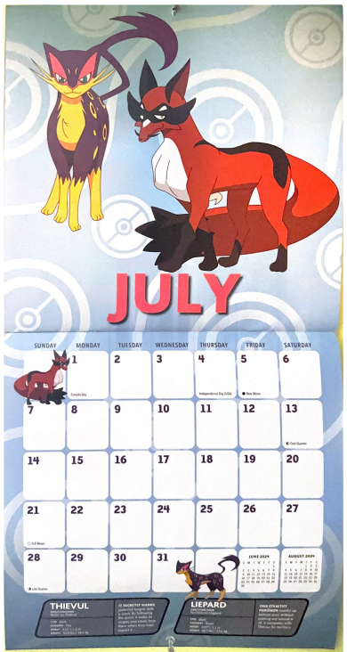
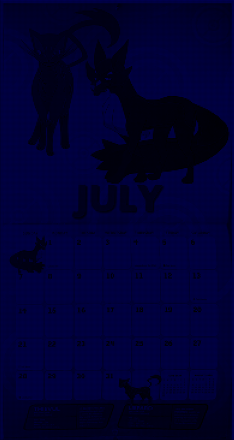

# Bayer-Filter-Mosaic
An implementation of a Bayer filter mosaic simulation. A Bayer filter mosaic is a color filter array used in digital image sensors for digital cameras to create color images. Built with Python, utilizing OpenCV 4.10.0.84 only for reading and writing image files. 

This project simulates how digital cameras "see" the world and take images. Specifically, my project outputs images that look to be acquired from the Bayer filter mosaic. It first takes a scan and creates a greyscale image of interleaved RGB channels, simulating the raw output of a digital camera. Then it reconstructs an RGB image by interpolating missing channel values from neighboring pixels. I used bilinear interpolation as the demosaicing method. This simple method created some artefacts along the edges in the reconstructed image, but the result is visually acceptable.

**You can click the image to view individually and with the correct aspect ratio.**

| 1. Original scan | 2. Bayer filter | 3. Color-coded Bayer |
|------------------|-----------------|----------------------|
||  | |

| 3. (a) Red channel      | 3. (b) Blue channel          | 3. (c) Green channel   |
|------------------|-----------------------|-----------------|
||  | |

| 4. Reconstructed image (demosaicing with bilinear interpolation) | 
|------------------------------------------------------------------|
|                    |

## Motivation
I used this project as an opportunity to learn more about image processing and computer graphics. In particular, I was curious how photosensors function in digital cameras to create images. 

## Try it with your own images 

### Creating an image
Add an image to the scans folder, preferably a scanned image or an image where the Bayer filter has not already been applied. I scanned my Pokemon calendar. You will have to specify the scan name in the code.

### Greyscale and color-coded Bayer filter outputs
An output of a simulated sensor with the same dimensions as the input scene with a Bayer filter is produced. It is grayscale because only data from one channel per pixel is recorded. The next output is color-coded with Bayer filter colors, followed by the separate RGB channels of the image. 

### Image reconstruction
Finally, the image is reconstructed using bilinear interpolation for demosaicing, averaging with the 2 nearest neighbors of the green pixels (for finding average red and blue values) and the 4 nearest neighbors of the red and blue pixels.