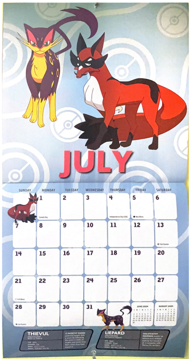
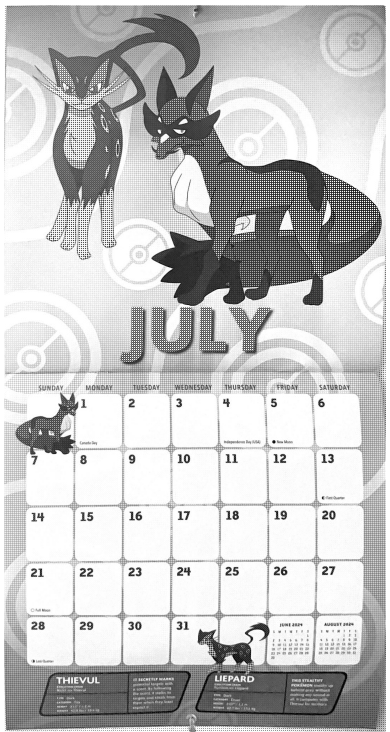
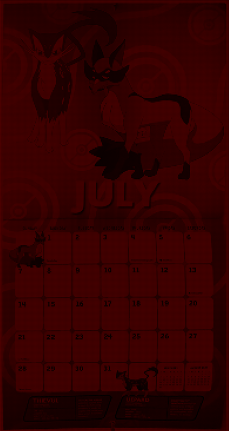
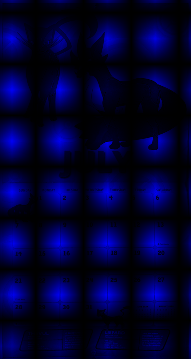
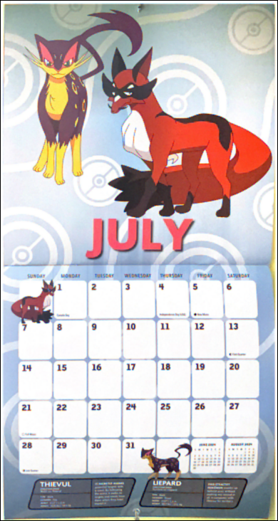

| 1. Original scan | 2. Bayer filter | 3. Color-coded Bayer |
|------------------|-----------------|----------------------|
||  | |

| 3. (a) Red channel      | 3. (b) Blue channel          | 3. (c) Green channel   |
|------------------|-----------------------|-----------------|
||  | |

| 4. Reconstructed image (demosaicing with bilinear interpolation) | 
|------------------------------------------------------------------|
|                    |